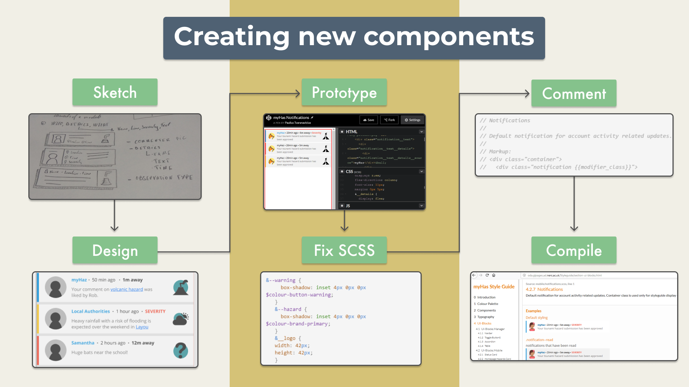

The number of organizations and projects using design systems [is increasing](https://designsystemssurvey.seesparkbox.com/2019/). This is a brief overview on how we approached creating a shared design system for [myHAZ-VCT PLATFORM](https://oda.bgs.ac.uk/) at BGS.

## What are design systems?

Design systems are collections of reusable components. In web and software development those components are usually color schemes, fonts, buttons, icons,  page layouts, etc. Below is an example of how a styleguide might look like.

*Envato.com styleguide* 

**Styleguides** usually answer the question 'what' (what are the main componens - the building blocks of an app or a website). **Design systems** go a bit further and provide more details on when and how to use the component and possibly the related research that explains why the component  is designed this way. For the sake of simplicity I'll refer to them as design systems.

Design systems are used by organizations such as [Government Digital Services](https://design-system.service.gov.uk/), [TED](https://medium.com/made-by-ted/design-systems-c9de81da0b75), [Airbnb](https://airbnb.design/building-a-visual-language/), [BBC](https://www.bbc.co.uk/gel/guidelines/category/design-patterns), [Atlassian](https://www.atlassian.design/), [Yelp](https://www.yelp.co.uk/styleguide), etc. 

Their aim is to:

- reduced duplicate effort (create same components only once)
- help app/websites look more consistent and professional (there shouldn't be five different types of success buttons)
- make things quicker to build (make all the low level decision at the beginning and then you can focus on the big picture)
- improve usability (the common elements are more recognizable)
- improve performance by removing duplicate code
- allow designers and developers to cooperate more easily
- create brand unity

Since they seem to provide so many benefits, it would seem unwise not to use them.

## How do you know if you need a design system?

[myHAZ-VCT PLATFORM](https://oda.bgs.ac.uk/) seemed like a good candidate to benefit from a design system. It's a service/platform made of three different but related applications. All of them share a purpose to disseminate hazard observations. 

Here are a few of the reasons why we decided to jump on the band wagon of design systems as well: 

- consistent look - we wanted the three different applications to feel like part of the same product
- improved user experience - people switching between different platforms would learn the new interactions quicker
- efficiency - remove duplicate work (even though the three applications are different, they share many elements)
- customization - to be able to adapt the application in new contexts in the future (create new themes more easily

## One of many ways to create design system

Once we had a good understanding of user goals, the common tasks they perform and pain points that might arise in their journey, we created a rough prototype to visualize the various task flows for all three application. 

After a few iterations and user testing we were pretty certain how the three platforms are going to work. So it was time to start building. 

Some design systems are created in advance of product development, some - only after the product is released and a need to make it more consistent arises. In our case, it was built simultaneously with the three apps it was supposed to support.

## Design principles

Design system doesn't have to be considered only after the research stage. Broader design principles can be set early in the design process. This is one the principles we defined: 

*"The purpose of myHaz is to help people collect, analyze and respond to natural hazards related information. That's why usability, performance and accessibility should be prioritized over experimental design. This way it can be used by as many people as possible with wide range of skills and in a wide range of contexts."*

## Moodboard

Moodboards help you define the look and feel of the product you're creating. 

We wanted the tone to match the purpose of the app - to help people report hazards, to be notified of danger and to monitor the data being collected. Since the app would be used by people living in Saint Vincent and the Grenadines (island country in the eastern Caribbean Sea), we also wanted it to feel like it belongs there.

 *myHaz moodboard*

We created a moodboard using pictures, paintings, architecture and other assets from people in that region. This helped us get a better feel for the place where this platform would be used and the people who would use it.

We settled on a pallet was that was filled with warm and light tones. But we also added some bright red to resemble the danger that the app is supposed to help notice, report and analyze.

*myHaz styleguide in Figma*

## UI Inventory

First thing we did was create a UI inventory of the elements required for the three different applications. Most design systems have a lot in common - they need buttons, checkboxes, toggles, form elements, tables, etc.

One thing we learned is that it's better to keep the components modular - that way they can be used in more contexts than one. Instead of creating a specific card component with other components nested within it, it's better to divide larger components into smaller bits and have them separately in the design system. However, we haven't always stuck to this principle and some components were created just for a single use case.

*Status card from the myHaz design system*

This is what Brad Frost calls 'Atomic Design'. Start with the smallest bits - the atoms (typography, colors), combine them into bigger bits - the molecules (cards, list elements), then, collections of molecules can become -  organisms (collections of cards, lists, etc.) and so on. Maybe it's not the most biologically accurate metaphor, but the principle is similar - order on the smaller scale, creates order on the larger scale.

*Atomic design principles by http://atomicdesign.bradfrost.com*

## Tools for design systems

There are many tools to help you with design system creation. They range from design centric to code centric and everything in between. Some examples of these tools: [Storybook](https://storybook.js.org/), [InVision Design System Manager](https://www.invisionapp.com/design-system-manager), [Pattern Lab](https://patternlab.io/), [UXPin](https://www.uxpin.com/), [Fractal](https://fractal.build/), [KSS](https://warpspire.com/kss/), [Sketch](https://www.sketch.com/), [Figma](https://www.figma.com/), etc.

Our main requirements for the design system tool was for it be easily accessible by all developers, quick to update and easy to document. So we settled on the [KSS node](https://github.com/kss-node/kss-node). It's a node.js implementation of [KSS](https://warpspire.com/kss/): a methodology for documenting and sharing stylesheets.

*An example of a documented component*

Basically, it's a static site generator that converts scss files and corresponding documentation into a website where those components and their code can be previewed.

*Comments and related scss code are compiled into a static website*

There is a useful guide on [csstricks.com](http://csstricks.com) on how to set it up. [https://css-tricks.com/build-style-guide-straight-sass/](https://css-tricks.com/build-style-guide-straight-sass/)

## Design system integration into multiple projects

The main purpose of this styleguide was to provide a single stylesheet and the building blocks for three different applications.  If people switched from using the app, to using the web portal - it should feel like it's part of the same experience.

*Design systems are more useful when they support multiple products*

Two of the apps shared a similar tech stack: portal and manager were built using Angular - so it was slightly easier to integrate it. But the mobile app was built using a slightly different technology - Ionic which, however uses Angular as well, but has its own quirks. 

Ionic has its own design library and its own way to create new themes for its apps, so incorporating the styleguide from KSS wasn't as straightforward.

But in general both of these apps work with SCSS files, so we set up an automated process on GitLab to fetch the relevant files from the design system repository and load them into the appropriate locations on other projects. This process wasn't 100% automated (mobile stylesheets were slimmed down manually to remove unnecessary styles for mobile platform), but it made thing slightly simpler.

## Workflow

Once we had the workflow setup the creation of new components looked something like this:

*The process for creating new components*

**Step 1:** Sketch out the elements or use the existing ones from the prototype in Balsamiq.

**Step 2:** Recreate them in higher fidelity in Figma.

**Step 3:** Prototype them in [codepen](https://codepen.io/) (it's a good place to experiment with small bits of code when you want to see the changes instantly)

**Step 4:** Refactor the scss code to be more readable (we used BEM model for writing css code - it makes it easier to see how different parts of a component are related to each other). 

*An example of scss code structured using BEM methodology*

**Step 5:** Write the comments for the component which would be used to generate the components and related documentation on the static website

**Step 6:** Then project would listen to file changes and recompile. It was stored on gitlab, and we used gitlab pages to make it accessible to everyone without the need to run it locally. And from that gitlab repository the other projects could fetch the necessary stylesheets.

## Reflection. Does everyone project need a design system?

Overall, it wasn't a smooth ride, but it helped us achieve our goals - the three applications had a consistent and unified look, and we could focus more on the interactions and user experience more instead of thinking what shadows or border radius to use on each element. However, we haven't tried to apply a different theme for this platform. It might be a challenge for the future.

Creating a design system for one, even though large project can be a challenging task. For a design system to stay relevant it has to be managed and updated. Otherwise, it can go out of sync with the projects that rely on it quickly.

It's often easier, especially on smaller projects, to rely on other libraries like [Angular material](https://material.angular.io/), [bulma](https://bulma.io/), [Sematinc UI](https://semantic-ui.com/), etc. You might loose the brand unity, but you save time.

I saved the drawbacks of design systems for the end:

- they take a long time to create
- they have to be maintained to stay relevant
- they require buy-in from the whole team
- accessibility can be neglected sometimes

And a few things we learned in this process:

- Keep the design system modular. Focus on the small things - consistent fonts, limited color palette, limited button styles - and it will create more visual harmony on the larger scale
- Get feedback from other team members early to see whether those components work in their applications and how well they integrate with other UI elements.
- Think about accessibility early - make sure the navigation bars can be accessed using only keyboard, the headings follow each other in a descending order (h1, h2, h3...), etc.
- Add a prefix to your class names so they don't conflict with other libraries that might use the same name (.-mh-table, instead of just .table). We learned it the hard way when we found out another library was using the same class name.

If we were to do it again, we might use [Storybook](https://storybook.js.org/). It seems like a promising way to create and maintain component libraries, that is being adopted by many big name projects and organizations.

*See more design systems examples at [Design Systems Repo](https://designsystemsrepo.com/design-systems/)*

However, for these benefits that design systems provide to become true you have to invest time in them, use them in more projects, make them more visible and more easily accessible.

Creating a new designs system for each project is not useful. Since you want to eliminate duplicate work it might be easier to rely on external libraries.

Brad Frost, in his book '[Atomic Design](http://atomicdesign.bradfrost.com/)', says that *'A design system should be a long-term commitment with the ambitious goal of revolutionizing how your organization creates digital work.'*
